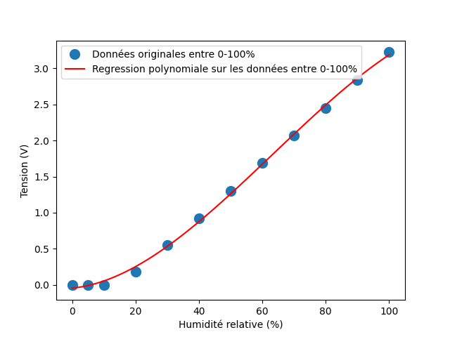

# Analyse du projet Capteur et Actionneur
Auteurs : Timothée Charrier et Alexis Bechet \
Date : 29/01/2023
--- ---
# Affichage des résultats de la régréssion linéaire

  L'équation de la droite de régression linéaire est : \ 

    \begin{equation}
    0.0381x - 0.586
    \end{equation}

# Affichage des résultats de la régréssion polynomiale

    L'équation de la droite de régression polynomiale est : \ 
    
        \begin{equation}
        -3.129.10^{-6}x^{3} + 0.0005934x^{2} - 0.004297x - 0.04603
        \end{equation}

